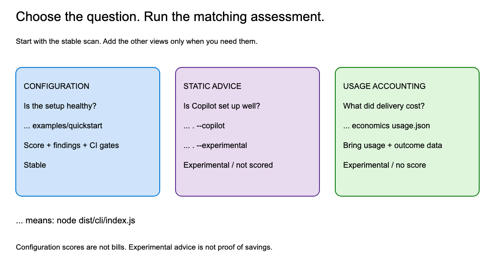
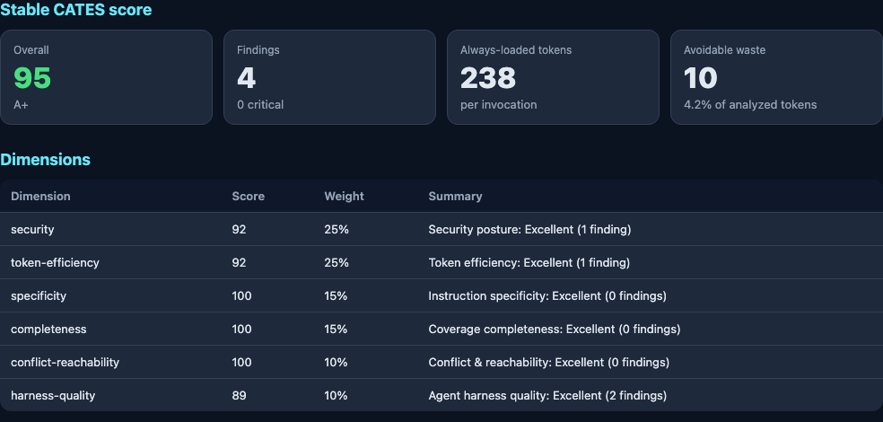

# CATES Configuration Analyzer

**Understand your coding-agent configuration. Find avoidable token use.
Measure delivery cost when you have usage data.**

CATES is the reference implementation of the **Coding Agent Token Economics
Standard**. Start with a local, static configuration scan: no model calls or
provider API keys are required.

**[Read the illustrated user guide](docs/USER-GUIDE.md)** for every feature,
real screenshots, copy-and-paste examples, and troubleshooting.



## Quick start

Requires **Git, Node.js 22.12+ and npm 10+**. These commands work from source;
no published npm package or container image is needed.

```bash
git clone https://github.com/microsoft/cates.git
cd cates
npm ci
npm run build
node dist/cli/index.js examples/quickstart
```

The bundled example has an intentional duplicate instruction so you can see a
real finding. The scan reads configuration; it does not execute that content.

**Now scan your own repository**, still from the CATES checkout:

```bash
node dist/cli/index.js /path/to/your-repo
```

If you installed the package, use `cates-analyzer` instead of
`node dist/cli/index.js`. The dedicated optimizer is `cates-optimize`, or
`node dist/optimizer/cli.js` from source.

## Prefer a browser?

After the checkout and dependency installation above:

```bash
npm run build:service
npm run service:start
```

Open **`http://localhost:8080`**, select a file kind, paste configuration, and
click **Score it**. Or use **Scan a repo** with a GitHub URL.



Follow the [pictured browser walkthrough](docs/USER-GUIDE.md#browser-walkthrough)
to enable Copilot advice, change rule toggles and export `.cates.yml`.
The service is anonymous by default; use an approved local/private deployment
for sensitive content.

## Pick the right assessment

| Question | Run from the checkout | Result |
| --- | --- | --- |
| Is this configuration healthy? | `node dist/cli/index.js /path/to/repo` | Stable score, findings and recommendations |
| Is Copilot configured appropriately? | `node dist/cli/index.js /path/to/repo --copilot` | Separate experimental hygiene/coverage report |
| What cache/output patterns should I review? | `node dist/cli/index.js /path/to/repo --experimental` | Separate experimental static advice |
| What did accepted delivery cost? | `node dist/cli/index.js economics examples/economics.json` | Experimental accounting from a synthetic usage ledger |
| What mechanical changes are possible? | `node dist/optimizer/cli.js /path/to/repo --dry-run` | Preview, with no files written |

**The stable scan is not a bill.** Copilot advice and cache/output advice do
not change stable scores or CI gates. Economics requires normalized usage,
prices/charges, coverage and outcome data; it does not collect telemetry or
fetch vendor prices. The bundled ledger is a scenario, not a real invoice.

## Features at a glance

| Feature | What it does | Learn how |
| --- | --- | --- |
| Stable configuration assessment | 49 rules across six weighted dimensions | [Read a report](docs/USER-GUIDE.md#read-the-report) |
| Multi-ecosystem discovery | Instructions, agents, prompts, editor rules, MCP, hooks, settings and setup | [Choose inputs](docs/USER-GUIDE.md#choose-the-input) |
| GitHub review | Repository, folder, exact file or PR; temporary clone cleanup | [Review workflows](docs/REVIEW-WORKFLOWS.md) |
| Copilot hygiene | 15 target-aware checks across 11 configuration families, with explicit coverage limits | [Copilot reference](docs/COPILOT-HYGIENE.md) |
| Cache/output shaping | Ten opt-in, non-scoring static checks | [Experimental advice](docs/USER-GUIDE.md#experimental-static-advice) |
| Runtime token economics | Cost per accepted task, retries, child calls, cache/reasoning subsets, non-model costs and provenance | [Economics walkthrough](docs/USER-GUIDE.md#token-economics) |
| Mechanical fixes and optimization | Separate previews/apply paths, backups and before/after reports | [Fix and optimize](docs/USER-GUIDE.md#fix-and-optimize) |
| Policy and suppressions | Rule/dimension overrides, reasons, optional expiry and explicit gates | [Policy and CI](docs/USER-GUIDE.md#policy-and-ci) |
| Conformance | Evaluate CATES Levels 1, 2 and 3 | [Conformance reference](docs/CONFORMANCE.md) |
| Reports | Pretty, JSON and SARIF; individual-file results and documented evidence-filtering limits | [Reporting](docs/USER-GUIDE.md#reports-and-tokenizers) |
| Tokenizer comparison | Four available tokenizer IDs; one canonical score and side-by-side counts | [Tokenizers](docs/USER-GUIDE.md#reports-and-tokenizers) |
| Multi-repository scanning | Local portfolio rollups or an explicit GitHub demo manifest | [Batch scans](docs/USER-GUIDE.md#portfolio-and-demo-scans) |
| Browser interface | Paste/scan, Copilot target selection, enable/disable controls and policy export | [Browser walkthrough](docs/USER-GUIDE.md#browser-walkthrough) |
| HTTP API | Analysis, GitHub scans, economics, catalogs and health probes | [API examples](docs/USER-GUIDE.md#http-api) |
| ESM library | Embed the analyzer, reports, gates, economics or optimizer | [Library example](docs/USER-GUIDE.md#javascript-library) |
| Container and scheduled jobs | Local Docker image plus a Helm Job/CronJob chart | [Docker and Helm](docs/USER-GUIDE.md#docker-and-helm) |
| CLI discovery | Rule explanations, tokenizer catalog, help and Bash/Zsh completion | [Command reference](docs/USER-GUIDE.md#command-reference) |
| Maintainer safeguards | Release preflight, explicit bootstrap/OIDC publishing paths, protection payload and assurance guidance | [Maintainer setup](docs/MAINTAINER-SETUP.md) |

## Useful first commands

```bash
# Explain the duplicate found in the quick-start example
node dist/cli/index.js explain TE007

# Preview duplicate/whitespace removal without changing the sample
node dist/optimizer/cli.js examples/quickstart \
  --dry-run --only dedupe-lines,whitespace

# Save the complete report
node dist/cli/index.js examples/quickstart --format json > report.json

# Explore all Copilot targets; use cli/vscode/cloud-agent/code-review to focus
node dist/cli/index.js /path/to/your-repo --copilot

# Inspect the synthetic cost-per-accepted-task example
node dist/cli/index.js economics examples/economics.json
```

The optimizer writes by default unless `--dry-run` is supplied. Its invariant
checks are not proof of unchanged agent behavior; inspect the diff and run your
own verification. Static token savings are not measured financial savings.

<a id="configuring-cates"></a>
## Policy and CI

Put `.cates.yml` in the repository you scan:

```yaml
minScore: 80
requireLevel: 1
failOn: [critical]
maxAlwaysLoadedTokens: 1500
copilot: all
```

The guide covers [overrides, suppressions and exit codes](docs/USER-GUIDE.md#policy-and-ci),
plus [JSON/SARIF export](docs/USER-GUIDE.md#reports-and-tokenizers). Review
coverage omissions as well as findings: a high score is not a security
certification, and an empty scan is not a passing assessment.

## Reference and boundaries

| Document | Use it for |
| --- | --- |
| [Illustrated user guide](docs/USER-GUIDE.md) | Running and understanding every user-facing feature |
| [CATES standard](CATES-v1.0.md) | Normative model and clearly separated experimental annexes |
| [Rule catalog](docs/RULE-CATALOG.md) | Individual detections and remediation |
| [Copilot hygiene](docs/COPILOT-HYGIENE.md) | All check families, target distinctions and unassessed areas |
| [Token economics](docs/TOKEN-ECONOMICS.md) | Every ledger field, equation, evidence boundary and worked example |
| [Governance playbook](docs/GOVERNANCE-PLAYBOOK.md) | Adoption and operating policy |
| [Maintainer setup](docs/MAINTAINER-SETUP.md) | Administrator actions, releases and assurance status |
| [Versioning](VERSIONING.md) / [changelog](CHANGELOG.md) | Compatibility, experimental stability and release history |

Local analysis does not call models or execute discovered configuration.
GitHub review deliberately uses network access. The HTTP service materializes
inputs in temporary storage and cleans them up; it is not RAM-only. The
application has no content telemetry, but deployments still need appropriate
authentication, access controls, retention and logging policies.

Runtime activation, organization policy, provider billing accuracy and causal
optimization benefits are not certified by a static scan.

**OpenSSF Best Practices status: not registered; no badge claimed.**
The [maintainer runbook](docs/MAINTAINER-SETUP.md) separates prepared controls
from actions that still require administrator or publisher access.

## Development

```bash
npm ci
npm run typecheck:all
npm test
npm run test:coverage
npm run build
npm run build:service
npm run release:check
```

`npm run service:dev` starts the service in watch mode. Coverage floors live in
`vitest.config.ts`; do not silently lower them. Image regeneration is described
in the [guide](docs/USER-GUIDE.md#about-the-pictures).

## License

Copyright (c) Microsoft Corporation.
Licensed under the [MIT License](LICENSE.TXT).

## Contributing

See [CONTRIBUTING.md](CONTRIBUTING.md), including the Microsoft Contributor
License Agreement requirement.

## Code of Conduct

This project has adopted the
[Microsoft Open Source Code of Conduct](https://opensource.microsoft.com/codeofconduct/).

## Security

Report vulnerabilities through the Microsoft Security Response Center process
in [SECURITY.md](SECURITY.md), not public GitHub issues.

## Support

See [SUPPORT.md](SUPPORT.md) for issues and help.

## Privacy and Telemetry

CATES does not collect telemetry or send analyzed content to Microsoft.
See [PRIVACY](PRIVACY).

## Trademarks

This project may contain trademarks or logos for projects, products, or services.
Authorized use of Microsoft trademarks or logos must follow
[Microsoft's Trademark & Brand Guidelines](https://www.microsoft.com/en-us/legal/intellectualproperty/trademarks/usage/general).
Use in modified versions must not cause confusion or imply Microsoft sponsorship.
Third-party trademarks and logos are subject to their respective policies.
